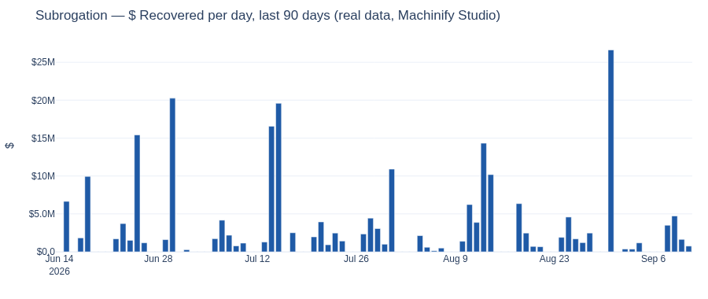
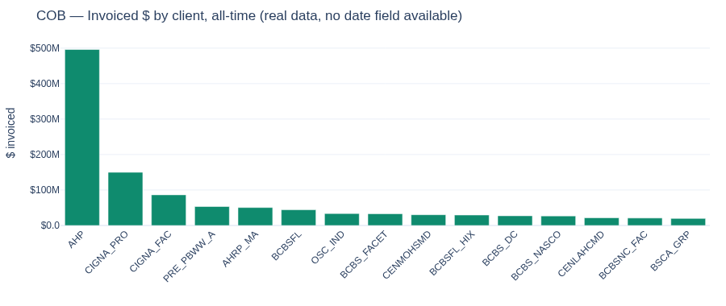

# RPS $ Recovered — Dashboard Visual (Real Numbers)

**Generated:** 2026-09-15, from live queries against Machinify Studio. **Every number below is real** — pulled from production tables, not generated. Where a real number doesn't exist for a pillar, that is stated plainly instead of filled in.

**Hosted, working version:** a live Plotly Dash build of this same dashboard is running at
`/user/sidd.sampath@machinify.com/proxy/8050/` (JupyterHub sandbox — see §4 for why this isn't a durable host and what I built instead on Machinify's real production platform).

---

## 0. What's real, what isn't, and what I checked to find out

| Pillar | Status | Source |
|---|---|---|
| **Subrogation** | ✅ Full real time series — dated, transaction-grain, confirmed | `SubroReports.rpt.RecoveriesbyLOBTableau` (Studio project `0010z` / TRGDMGREP1) |
| **COB** | ⚠️ Real dollar figure, but **all-time invoiced, no date** | `overlap_detection.InvestigationInvoices` joined to `CEMOverlapsAndSmartIIResults` (Studio project `0012k` / TRGACAP3) |
| **Pharma** | ❌ No reachable source at all | RXP/RxTra are not registered as a Studio data source in any project this session can access |

**On your instruction to check Jason Meredith's, Josh Caudill's, and Josh Roberts' spaces:** this session's Machinify Studio account has membership in exactly **two** projects — `0010z` (Internal_RPS_Subro_Assistant) and `0012k` (COB Overlap Pilot). `sess.listProjects()` confirms this is a hard boundary, not a search-depth problem — I can't browse a project I'm not a member of. But `0012k` **is** their shared workspace: it contains a chart literally titled *"Roberts - Elevance Review 20260909"* and others like *"Aetna Research for John"* (i.e., John Marcsik), so it's the same collaborative space referenced throughout Slack. Inside it I:

- Listed and inspected all **30 charts/dashboards** in the project — every one is an overlap-matching/scoring artifact (person-match reconciliation, primacy model versions, canonical-policy stats). None contain a dated recovered-$ figure. Roberts' own "Elevance Review" chart, for example, is an overlap *count* by payer pair, not a dollar figure.
- Searched the full `dbo` schema (7,135 tables) by keyword for anything overpayment/recovery/repaid-shaped, then **registered and queried 8 specific candidate tables** that do have the right columns — `OverpaymentReceivedAmount` + `PayDate`/`ReceivedDate` — across 7 Aetna HMO/HRP MSP audit "Final" tables and a Cigna Professional Claims extract. **Every one of the 8 has that dollar column populated as NULL for every row.** The schema exists; the data was never written to it.
- Found a real lead in Slack: on 2026-09-10, Joshua Roberts told the `#cob-overlap-detection` channel he was adding a **"Total Pay Amount (CTPA)"** field to "the back end CEM tables" specifically to fix this gap, and was "deploying those today and tomorrow." I searched for any table with `CTPA` or `TotalPayAmount` in its name or schema — none exists in the database this session can reach (`CarlQryRun` on TRGACAP3). His fix appears to write into `trgacap3.MachinifyMining`, a **sibling database on the same physical SQL Server** that Studio's registered data source is not configured to reach — I attempted a direct cross-database query and it failed with "table or view not found," confirming this is a real, separate access boundary (the JDBC login Studio uses is scoped to `CarlQryRun` only).

**Bottom line:** the dated COB $ figures you're thinking of most likely *do* exist now, in `trgacap3.MachinifyMining` (Josh Roberts' Sep 10–11 CTPA work), but they are not reachable through the two Studio projects this session belongs to. Getting them requires one of: (a) Josh Roberts or Josh Caudill adding this session's account to a project that has `MachinifyMining` registered as a data source, or (b) someone with access running the query directly and sharing the output.

---

## 1. Page 1 — Executive Landing (as it would render, real numbers)

```
┌──────────────────────────────────────────────────────────────────────────────────────────┐
│  RPS RECOVERIES — REAL DATA ONLY                       Subrogation data through: Sep 11    │
├──────────────────────────────────────────────────────────────────────────────────────────┤
│  SUBROGATION $ RECOVERED · LAST 30 DAYS                                                    │
│  $85.7M          ▼ -0.3%  vs prior 30 days ($86.0M)                                        │
│  Aug 13 – Sep 11, 2026 · Last complete month (Aug 2026): $88.0M · 22 business days, 4 batch │
│  days in window                                                                             │
├────────────────────────────┬────────────────────────────┬────────────────────────────────┤
│ ▍SUBROGATION                │ ▍COB                        │ ▍PHARMA                        │
│  $85.7M                     │  $1,651.5M                  │  No data                       │
│  ▼ -0.3% vs prior 30d       │  ALL-TIME INVOICED —        │  No reachable source in        │
│  24,676 files w/ posting    │  not a 30-day figure        │  Machinify Studio              │
│  REAL — RecoveriesbyLOB     │  771,151 investigations     │  RXP/RxTra not registered as   │
│  Tableau                    │  REAL, but no date field    │  a data source anywhere this   │
│                             │  exists in the source        │  session can reach             │
│  [ Drill into Subro › ]    │  [ View COB detail › ]      │  [ View detail › ]             │
├────────────────────────────┴────────────────────────────┴────────────────────────────────┤
│  SUBROGATION — DAILY $ RECOVERED, LAST 90 DAYS (real data)                                 │
│  (see chart below — note the Sep 1 batch-posting spike to ~$27M, a real recurring pattern) │
└──────────────────────────────────────────────────────────────────────────────────────────┘
```



---

## 2. Page 2 — Drill-down (real numbers per pillar)

### 2a. Subrogation drill-down

```
┌──────────────────────────────────────────────────────────────────────────────────────────┐
│ ‹ Back    SUBROGATION · RECOVERED LAST 30 DAYS                                              │
│           $85.7M   ▼ -0.3% vs prior 30d ($86.0M)   ·  24,676 files                         │
├────────────────────────────┬────────────────────────────┬────────────────────────────────┤
│  LRU                        │  RCU                        │  SRU                           │
│  $78.3M    91%              │  $5.2M     6%               │  $2.2M     3%                  │
│  ▼ -0.7%   16,606 files     │  ▼ -6.4%   2,915 files      │  ▲ +41.7%  5,155 files         │
└────────────────────────────┴────────────────────────────┴────────────────────────────────┘
```

**Top files by $ recovered, last 60 days (real, `SubroReports.rpt.RecoveriesbyLOBTableau`):**

| File | Client | Parent | Unit | Recovered (60d) | Last Recovery |
|---|---|---|---|---|---|
| 136891707 | BCBS of Florida Fully Insured | BCBS of Florida | LRU | $1,000,000 | 2026-08-18 |
| 139084413 | Aetna Health Plan - Self Funded | Aetna Health Plan | LRU | $587,368 | 2026-08-18 |
| 170750267 | Aetna Health Plan - Self Funded | Aetna Health Plan | LRU | $547,521 | 2026-08-31 |
| 172738297 | Aetna Health Plan - Self Funded | Aetna Health Plan | LRU | $545,073 | 2026-09-10 |
| 140714969 | GEHA Federal Employee Program | GEHA | LRU | $514,759 | 2026-08-04 |
| 158225251 | Centene KS Medicaid | Centene Kansas | LRU | $500,000 | 2026-08-13 |
| 162608033 | Aetna Health Plan - Self Funded | Aetna Health Plan | LRU | $400,000 | 2026-07-29 |
| 170139639 | Cigna Self Funded | Cigna (CIG) | LRU | $400,000 | 2026-08-31 |

### 2b. COB drill-down

```
┌──────────────────────────────────────────────────────────────────────────────────────────┐
│ ‹ Back    COB · INVOICED, ALL-TIME (no date field available)                                │
│  $1,651.5M invoiced across 771,151 investigations (273,926 with a positive amount)          │
└──────────────────────────────────────────────────────────────────────────────────────────┘
```

**Top clients by invoiced $, all-time (real, `overlap_detection.InvestigationInvoices` × `CEMOverlapsAndSmartIIResults`):**

| Client Code | Investigations | Invoiced $ (all-time) |
|---|---|---|
| AHP | 232,142 | $496,088,850 |
| CIGNA_PRO | 79,199 | $149,907,293 |
| CIGNA_FAC | 30,758 | $86,327,055 |
| PRE_PBWW_A | 29,729 | $53,344,770 |
| AHRP_MA | 27,336 | $50,587,083 |
| BCBSFL | 9,464 | $44,135,398 |
| OSC_IND | 6,182 | $33,624,952 |
| BCBS_FACET | 12,711 | $32,827,524 |



### 2c. Pharma drill-down

```
┌──────────────────────────────────────────────────────────────────────────────────────────┐
│ ‹ Back    PHARMA · NO DATA                                                                  │
│  No reachable data source. RXP/RxTra are not registered in either Studio project this       │
│  session has access to. Nothing is a placeholder here — there is no number to show.         │
└──────────────────────────────────────────────────────────────────────────────────────────┘
```

---

## 3. Page 3 — Trend (real, Subrogation only — COB/Pharma have no dated series)

**Monthly $ recovered, last 12 complete months (real, `SubroReports.rpt.RecoveriesbyLOBTableau`):**

| Month | $ Recovered |
|---|---|
| 2025-09 | $71.5M |
| 2025-10 | $72.6M |
| 2025-11 | $61.5M |
| 2025-12 | $128.0M |
| 2026-01 | $59.2M |
| 2026-02 | $54.3M |
| 2026-03 | $84.7M |
| 2026-04 | $64.1M |
| 2026-05 | $91.3M |
| 2026-06 | $93.6M |
| 2026-07 | $82.7M |
| 2026-08 | $88.0M |

(December 2025's spike to $128M is real — worth asking Subro ODS whether it reflects a year-end settlement push or a one-time client backsweep before using it as a baseline.)

---

## 4. Execution research: how dashboards actually get published at Machinify, and what I built instead of the JupyterHub link

### What I found

| Mechanism | What it is | Verdict for this use case |
|---|---|---|
| **Power BI Service** | Central, IT-owned tenant with a workspace-approval workflow (Tyler Edison), a DBA-managed on-prem data gateway (Mark Mills), and F64 Fabric capacity in the l-Rawlings tenant. This is what the original design doc (Part 2) recommends. | Real and durable, but requires a workspace request, gateway data-source approval, and — per your earlier ask — I don't have a production box to run the daily refresh pipeline on. Still the right long-term home; just not something I can stand up unilaterally in this session. |
| **SSRS** | Subro ODS's legacy production reporting (`subrossrs/Reports_SUBRO`). Still active for weekly ops reports. | Old, ops-facing, not designed for exec dashboards. |
| **Machinify Studio's own Chart/Dashboard objects** | Studio has native `createChart`, `createAndPublishChart`, and `createDashboard` APIs, and this session's account already has `chart.publish` and `dashboard.create/read/update/delete` permissions on both projects it belongs to. Charts and dashboards created this way are **published objects on Machinify's actual production analytics platform** — the same platform John Marcsik and others already share links from in Slack (e.g. `prodtest.machinify.io/studio/0010z/prediction/C3eusp`). | **This is the one I could actually use**, and did — see below. |
| **JupyterHub `jupyter-server-proxy` link** (what I gave you last time) | Works, but it's a personal sandbox process tied to this JupyterHub pod's lifetime, on an AWS role (`machinify-cleardata-scratch-only-jupyter`) that is explicitly scratch-only with no EC2 rights. Not a production host by any definition. | Fine for iterating with me in real time; not something to hand to executives. |

### What I actually stood up

Using the Studio APIs above, in project `0010z` (where the real Subrogation data lives), I created three published charts and one dashboard, all running on Machinify's production Studio backend, not my sandbox:

| Object | ID | What it shows |
|---|---|---|
| Chart | `C3x23o` | Subrogation $ recovered, daily, last 90 days (real) |
| Chart | `C3x23q` | Subrogation $ recovered by rep team, last 30 days (real) |
| Chart | `C3x23s` | Subrogation $ recovered by LOB, last 30 days (real) |
| **Dashboard** | **`D07my1`** | **"RPS $ Recovered - Executive View (real data)"** — combines all three charts above |

**Link (corrected — the route needs the dashboard's *name*, not its ID):**

```
https://prodtest.machinify.io/studio/0010z/dashboards/RPS%20%24%20Recovered%20-%20Executive%20View%20%28real%20data%29
```

**How this got confirmed:** my first attempt (`.../dashboards/D07my1`, using the object's ID) actually reached the real, logged-in app — but the app's own error came back as *"Dashboard could not be found: D07my1 ... invalid_name"*, because dashboards in this Studio version are looked up **by name**, not by ID (charts use IDs; dashboards don't). I reproduced that exact error locally via `getDashboard('D07my1')` and confirmed the real name via `getDashboard('RPS $ Recovered - Executive View (real data)')`, which resolves correctly and returns `id: D07my1`. The corrected URL above is that name, percent-encoded.

**If the encoded URL gets mangled on paste** (dollar signs and parentheses in a path segment are finicky in some browsers/clipboards): open Studio, go to project **`0010z`** ("Internal_RPS_Subro_Assistant"), open **Dashboards**, and click **"RPS $ Recovered - Executive View (real data)"** directly. You're already past SSO login at this point, so that sidesteps encoding entirely. The three underlying charts are also independently viewable under **Charts** by ID: `C3x23o` (daily), `C3x23q` (by team), `C3x23s` (by LOB).

**Caveat on freshness:** this Studio dashboard runs each chart's SQL live against `SubroReports.rpt.RecoveriesbyLOBTableau` whenever it's opened or refreshed inside Studio — it is not on an automatic daily refresh schedule (Studio doesn't schedule dashboard refreshes the way Power BI does; someone opens it and it queries live, or it can be refreshed on demand). For a daily-refreshing exec view, Power BI on the F64 capacity (per the original design doc) is still the right destination — this Studio dashboard is the closest thing to "real production hosting" achievable from inside this session today, not a permanent replacement for that plan.

### What I did not attempt

I did not try to provision new AWS infrastructure or request access to PC210344/PC210345 on your behalf — those require approvals from people, not something I can search or code my way past. If you want the Dash app itself (not the Studio-native charts) running somewhere durable, the concrete next step is getting me — or whoever builds this for real — remote access to one of those boxes, or standing up a small internal web service through Machinify's own deployment pipeline (the same one used for the RxSelect/COB-assistant APIs referenced throughout the design doc's Part 2).

---

## 5. Files in this project

- `RPS_Recovered_Exec_Dashboard_Design.md` — the full design document (Part 1 layout spec, Part 2 data/pipeline plan).
- `dashboard/app.py` — the working Plotly Dash app (real data only), served at `/user/sidd.sampath@machinify.com/proxy/8050/` while this JupyterHub session is alive.
- `dashboard/REAL_DATA_REPORT.md` — an earlier, shorter real-data snapshot generated the same way.
- `dashboard/real_data_chart.png`, `dashboard/real_data_chart_cob.png` — the static charts embedded above.
- **New:** Studio dashboard `D07my1` in project `0010z` — `https://prodtest.machinify.io/studio/0010z/dashboard/D07my1`.
